# Terraform CI/CD with GitHub Actions

[](https://github.com/ugochuk/terraform-cicd-github-actions/actions/workflows/terraform-pr.yml)

Production-minded Terraform delivery pipeline using GitHub Actions, Azure OIDC authentication, pull-request quality gates, security scanning, plan artifacts, protected environments, controlled apply, and post-deployment validation.

## What this project demonstrates

- Terraform CI/CD design for Azure
- GitHub Actions YAML pipelines
- Passwordless Azure authentication with OpenID Connect (OIDC)
- `fmt`, `validate`, TFLint, and Trivy IaC security gates
- Pull-request Terraform plan generation
- Plan artifact retention between jobs
- Separation of plan and apply responsibilities
- GitHub Environment approval for production deployment
- Concurrency controls to prevent overlapping production applies
- Post-deployment validation with Azure CLI
- Least-privilege workflow permissions

## Delivery flow

```mermaid
flowchart LR
    DEV[Developer] --> PR[Pull Request]
    PR --> FMT[terraform fmt]
    FMT --> VAL[terraform validate]
    VAL --> LINT[TFLint]
    LINT --> SEC[Trivy IaC]
    SEC --> PLAN[Terraform Plan]
    PLAN --> ART[Plan Artifact]
    ART --> REVIEW[Review / Approval]
    REVIEW --> APPLY[Controlled Apply]
    APPLY --> VERIFY[Post-deployment Validation]
```



## Repository structure

```text
.
├── .github/workflows/
│   ├── terraform-pr.yml
│   └── terraform-apply.yml
├── scripts/
│   └── post-deploy-validation.sh
├── terraform/
│   ├── main.tf
│   ├── outputs.tf
│   ├── providers.tf
│   ├── terraform.tfvars.example
│   ├── variables.tf
│   └── versions.tf
├── .gitignore
└── README.md
```

## Authentication model

This project intentionally avoids long-lived Azure client secrets. GitHub Actions authenticates to Azure through workload identity federation using `azure/login` and GitHub's OIDC token.

Configure these GitHub repository or environment variables:

- `AZURE_CLIENT_ID`
- `AZURE_TENANT_ID`
- `AZURE_SUBSCRIPTION_ID`

The Azure application or managed identity must have a federated credential scoped to this repository and the intended GitHub branch/environment.

## Pull-request workflow

The PR pipeline performs:

1. Checkout
2. Terraform setup
3. Formatting verification
4. Initialization
5. Validation
6. TFLint
7. Trivy IaC security scan
8. Azure OIDC authentication
9. Terraform plan
10. Upload of the generated plan as an artifact

No infrastructure changes are applied from pull requests.

## Apply workflow

The apply workflow is manually triggered and uses the GitHub `production` Environment. In a real organization, that Environment should require designated reviewers before the job can proceed.

The workflow:

1. Authenticates through OIDC
2. Re-runs Terraform quality checks
3. Produces a fresh plan
4. Applies the reviewed configuration
5. Runs Azure CLI post-deployment validation

A fresh plan is intentionally generated during the controlled deployment rather than trusting an arbitrarily old plan artifact.

## Local usage

```bash
cd terraform
terraform init
terraform fmt -check
terraform validate
cp terraform.tfvars.example terraform.tfvars
terraform plan
```

## Why the pipeline is structured this way

CI validates every proposed infrastructure change before merge, while deployment is isolated behind an explicit production environment. OIDC removes stored Azure credentials, limited GitHub token permissions reduce workflow blast radius, and deployment concurrency prevents two production applies from racing against the same state.

## Portfolio note

This is an original portfolio implementation. It contains no proprietary employer code, customer configuration, credentials, tenant IDs, subscription IDs, or internal pipeline definitions.
