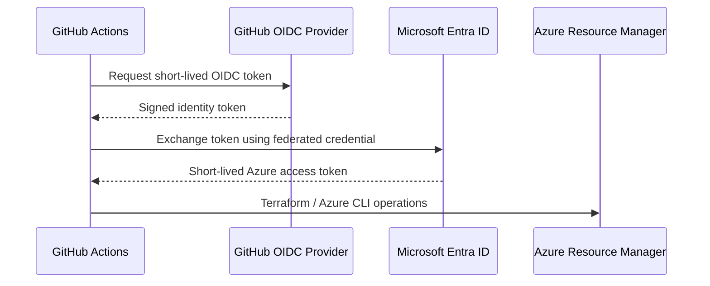

# Azure OIDC Setup

This repository is designed to authenticate GitHub Actions to Azure without storing a client secret.

## Identity flow



## Azure configuration

Create an Entra application or user-assigned managed identity dedicated to CI/CD. Add a federated identity credential whose issuer is GitHub and whose subject is restricted to this repository and the intended branch or GitHub Environment.

Grant only the Azure roles required by the Terraform deployment scope. Avoid broad subscription Owner permissions when a narrower resource group or custom role is sufficient.

## GitHub configuration

Define these as GitHub repository or Environment variables:

- `AZURE_CLIENT_ID`
- `AZURE_TENANT_ID`
- `AZURE_SUBSCRIPTION_ID`

These values identify the Azure identity and tenant but are not passwords. The workflow receives permission to request an OIDC token through:

```yaml
permissions:
  contents: read
  id-token: write
```

## Production Environment

Create a GitHub Environment named `production` and configure required reviewers. The apply workflow targets this environment, making approval part of the deployment control rather than embedding a manual confirmation in shell code.

## Recommended enterprise controls

- Restrict federated credentials to expected repository subjects.
- Use separate deployment identities per environment.
- Scope Azure RBAC to the minimum required deployment boundary.
- Require pull requests and branch protection on `main`.
- Require successful validation/security checks before merge.
- Protect the production GitHub Environment with required reviewers.
- Use a remote Terraform backend with locking and encryption.
- Send deployment audit events to centralized monitoring.
